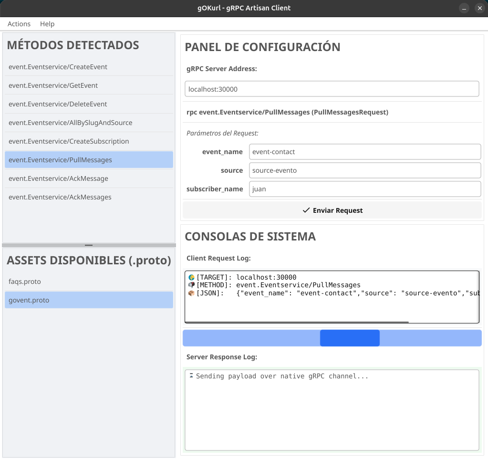
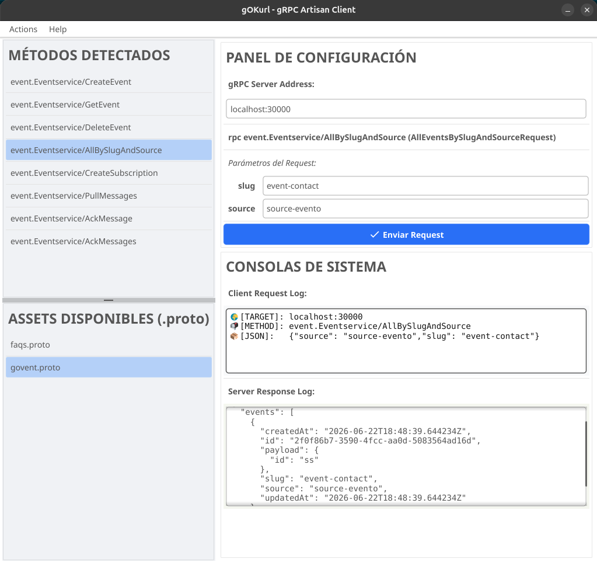

# gOKurl - The Artisan gRPC Client

<p align="center">
  
  
  
  
</p>

**gOKurl** is an elegant, zero-dependency desktop GUI client tailored for interacting with gRPC microservices. Engineered with a focus on software craftsmanship, it abandons external terminal binaries in favor of a 100% pure Go implementation. It parses Protobuf schemas in memory, establishes direct dynamic RPC channels, and delivers structural telemetry through a high-contrast, bento-inspired cockpit.

---

## Visual Overview

<p align="center">
  
  <br><br>
  
</p>

---

## Architecture Highlights

* 🚀 **Zero-Dependency Engine:** Fully autonomous. It leverages `bufbuild/protocompile` and `dynamicpb` for native in-memory reflection. No `grpcurl` or external toolchains are required on the host machine.
* 🧬 **Recursive Payload Normalization:** Advanced JSON interception. If your microservices embed stringified JSON payloads inside generic fields like `payload`, `data`, or `body`, gOKurl recursively unpacks and pretty-prints them into a unified, highly readable tree.
* ⚡ **Asynchronous Fluidity:** Network calls are decoupled into background goroutines with visual infinite loaders, ensuring the UI remains buttery smooth and responsive even during high-latency server cold starts.
* 🎨 **Dynamic Telemetry Styling:** The system console dynamically mutates its background color using custom RGBA algorithms upon successful requests, providing immediate, satisfying visual feedback.
* 🗂️ **Smart Asset Synchronization:** Automatically tracks and caches `.proto` schemas in a local `assets/` directory for rapid persistence across sessions.
* 🛡️ **Standard Google Imports:** Natively resolves standard Google Protobuf types like `Timestamp` or `Empty` out-of-the-box via `WithStandardImports` injection.

---

## Interface Topology

```text
 _____________________________________________________________________
|  MÉTODOS DETECTADOS        |  PANEL DE CONFIGURACIÓN                |
|  - service.Method1         |  [ Host: localhost:50051            ]  |
|  - service.Method2         |                                        |
|____________________________|  Parámetros del Request:               |
|  ASSETS DISPONIBLES        |  [ Field A: Type                     ]  |
|  - api.proto               |  [ Button: Enviar Request 🚀         ]  |
|  - health.proto            |________________________________________|
|                            |  Client Request Log (Monospace Slate)  |
|                            |  [==== Loader Bar ====]                |
|                            |  Server Response Log (Dynamic Tint)    |
|____________________________|________________________________________|

```

---

## Getting Started

### Prerequisites

Since gOKurl is a self-contained binary, you only need the Go toolchain to build it from the source.

### Local Development

1. Clone the repository and navigate into the workspace:
```bash
git clone [https://github.com/your-username/gokurl.git](https://github.com/your-username/gokurl.git)
cd gokurl

```


2. Download dependencies and run the application:
```bash
go mod tidy
go run main.go

```


---

## Production Packaging

This project is configured to be cross-compiled natively using `fyne-cross` via Docker, avoiding local CGO/C++ compiler pollution.

To generate distribution-ready binaries for Linux, Windows, and macOS:

```bash
# Requires fyne-cross installed: go install [github.com/fyne-io/fyne-cross@latest](https://github.com/fyne-io/fyne-cross@latest)
make release-all

```

*Note: Ensure an `Icon.png` file exists in the root directory before running the release command to embed the application icon into the OS packages.*

---

## License

This software is distributed under the **Apache License, Version 2.0**.

```text
Copyright 2026 MDK | Markitos DevSecOps Kulture

Licensed under the Apache License, Version 2.0;
you may not use this file except in compliance with the License.
You may obtain a copy of the License at

    [http://www.apache.org/licenses/LICENSE-2.0](http://www.apache.org/licenses/LICENSE-2.0)

Unless required by applicable law or agreed to in writing, software
distributed under the License is distributed on an "AS IS" BASIS,
WITHOUT WARRANTIES OR CONDITIONS OF ANY KIND, either express or implied.
See the License for the specific language governing permissions and
limitations under the License.

```

---